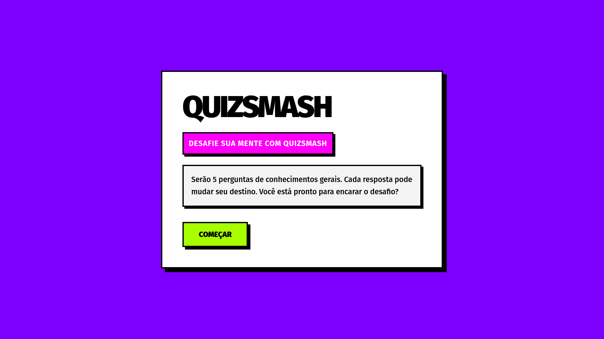

<h1 align="center">QuizSmash</h1>

  <em>Modern Interactive Quiz Experience</em>

  
  

---

## 📌 Sobre o Projeto

O **QuizSmash** é uma aplicação de quiz interativa desenvolvida com foco em:

- Experiência fluida  
- Interface moderna  
- Código organizado e escalável  

O projeto explora boas práticas de desenvolvimento frontend, combinando estrutura limpa com interatividade dinâmica.

---

## 🔎 Preview

  

---

## 🚀 Funcionalidades

- Sistema dinâmico de perguntas e respostas  
- Feedback visual imediato  
- Interface 100% responsiva  
- Estrutura modular e organizada  

---

## 🛠 Stack Utilizada

| Tecnologia      | Finalidade |
|----------------|------------|
| HTML5          | Estrutura da aplicação |
| TailwindCSS    | Estilização e responsividade |
| JavaScript     | Lógica e interatividade |

---

## 🌐 Deploy

Se publicado: https://quizsmash.vercel.app/

---

  Se este projeto foi útil para você, considere deixar uma ⭐ no repositório.

